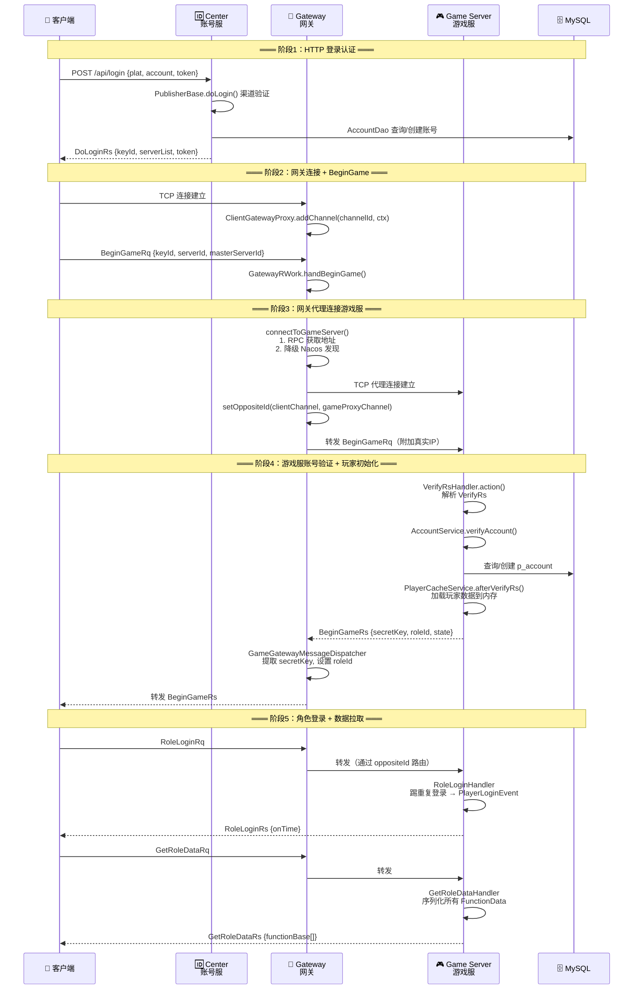
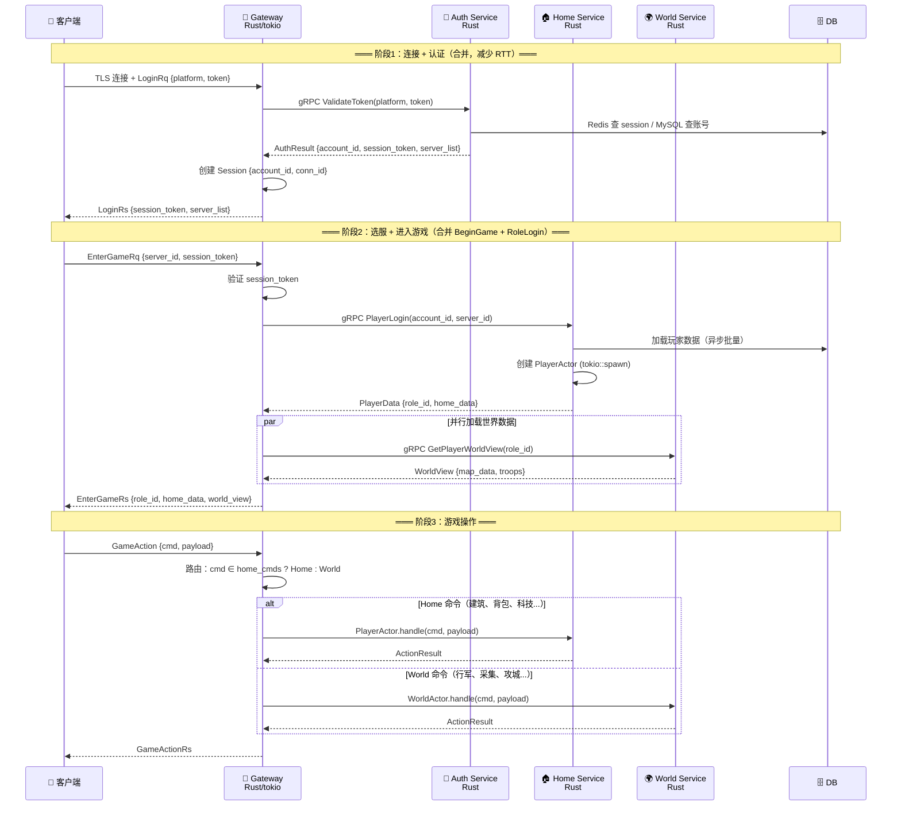

# Imperial Sim — Rust 高性能重构架构设计

> 文档定位：将当前 Java SLG 游戏服务端重构为 Rust 高性能架构的完整方案
> 作者：架构组
> 日期：2026-04-16
> 状态：设计阶段

---

## 一、当前 Java 架构登录流程分析

### 1.1 现有服务拓扑

```
客户端 ──HTTP──▶ Center（账号服）──▶ 返回 token + 区服列表
  │
  └──TCP/WS──▶ Gateway（网关）──TCP──▶ Game Server（游戏服）
```

### 1.2 现有登录时序（4 阶段）



### 1.3 现有架构核心类映射

| 层级 | Java 类 | 职责 |
|------|---------|------|
| Center | `DoLogin` | 登录入口，调用 `AccountService.doLogin()` |
| Center | `AccountService` | 渠道验证、账号创建、token 生成 |
| Gateway | `ClientGatewayProxy` | 管理客户端连接 `Map<channelId, ctx>` |
| Gateway | `GameGatewayProxy` | 管理游戏服代理连接 `Map<channelId, Channel>` |
| Gateway | `GatewayRWork` | 处理 BeginGame，连接游戏服（RPC → Nacos 降级） |
| Gateway | `ClientGatewayMessageDispatcher` | 客户端消息分发，通过 oppositeId 路由到游戏服 |
| Gateway | `GameGatewayMessageDispatcher` | 游戏服响应分发，提取 secretKey/roleId |
| Gateway | `SessionUser` | 会话信息（accountKey, serverId, channelId） |
| Game | `VerifyRsHandler` | 接收网关转发的验证请求 |
| Game | `AccountService` | 账号验证、玩家创建/加载 |
| Game | `RoleLoginHandler` | 角色登录、踢重复、派发 PlayerLoginEvent |
| Game | `GetRoleDataHandler` | 序列化所有 FunctionData 返回客户端 |

---

## 二、Rust 重构目标架构

### 2.1 设计原则

1. **零拷贝消息传递** — 使用 `bytes::Bytes` + flatbuffers/protobuf 避免序列化开销
2. **Actor 模型** — 每个玩家一个轻量级 tokio task，替代 Java Disruptor
3. **Home/World 分离** — 玩家个人数据（Home）与世界共享数据（World）独立服务
4. **无锁设计** — 通过 channel 通信替代共享内存锁
5. **编译期安全** — 利用 Rust 类型系统消除运行时空指针和并发 bug

### 2.2 服务拓扑（Rust 版）

```
                    ┌─────────────────────────────────────────────┐
                    │              Rust 服务集群                    │
                    │                                             │
 📱 Client ──TLS──▶│  ┌──────────┐    ┌───────────┐              │
                    │  │ Gateway  │───▶│ Home Svc  │──┐           │
                    │  │ (tokio)  │    │ (玩家个人) │  │  ┌──────┐ │
                    │  │          │    └───────────┘  ├─▶│  DB  │ │
 📱 Client ──TLS──▶│  │ 连接管理  │    ┌───────────┐  │  │MySQL │ │
                    │  │ 消息路由  │───▶│ World Svc │──┘  │Redis │ │
                    │  │ 鉴权     │    │ (世界地图) │     └──────┘ │
                    │  └──────────┘    └───────────┘              │
                    │       │                                     │
                    │       │          ┌───────────┐              │
                    │  ┌────▼─────┐    │ Cross Svc │              │
                    │  │ Auth Svc │    │ (跨服)    │              │
                    │  │ (账号)   │    └───────────┘              │
                    │  └──────────┘                               │
                    └─────────────────────────────────────────────┘
```

### 2.3 Rust 版登录时序



---

## 三、Home / World 拆分设计

### 3.1 职责划分

```
┌─────────────────────────────────────────────────────────────┐
│                    Home Service（玩家个人）                    │
│                                                             │
│  ┌──────────┐ ┌──────────┐ ┌──────────┐ ┌──────────┐      │
│  │ 建筑系统  │ │ 背包系统  │ │ 科技研发  │ │ 将领系统  │      │
│  └──────────┘ └──────────┘ └──────────┘ └──────────┘      │
│  ┌──────────┐ ┌──────────┐ ┌──────────┐ ┌──────────┐      │
│  │ 装备系统  │ │ 任务系统  │ │ 商店系统  │ │ VIP系统   │      │
│  └──────────┘ └──────────┘ └──────────┘ └──────────┘      │
│  ┌──────────┐ ┌──────────┐ ┌──────────┐                   │
│  │ 邮件系统  │ │ 聊天系统  │ │ 社交系统  │                   │
│  └──────────┘ └──────────┘ └──────────┘                   │
│                                                             │
│  特点：每个玩家一个 Actor，无锁，高并发                         │
│  数据：p_account, p_data（各 function blob）                 │
│  扩展：按玩家 ID 分片，水平扩展                                │
└─────────────────────────────────────────────────────────────┘

┌─────────────────────────────────────────────────────────────┐
│                   World Service（世界共享）                    │
│                                                             │
│  ┌──────────┐ ┌──────────┐ ┌──────────┐ ┌──────────┐      │
│  │ 世界地图  │ │ 行军系统  │ │ 采集系统  │ │ 攻城系统  │      │
│  └──────────┘ └──────────┘ └──────────┘ └──────────┘      │
│  ┌──────────┐ ┌──────────┐ ┌──────────┐ ┌──────────┐      │
│  │ NPC据点  │ │ 联盟战争  │ │ 资源点   │ │ 部队管理  │      │
│  └──────────┘ └──────────┘ └──────────┘ └──────────┘      │
│  ┌──────────┐ ┌──────────┐                                 │
│  │ 排行榜   │ │ 阵营系统  │                                 │
│  └──────────┘ └──────────┘                                 │
│                                                             │
│  特点：地图分区 Actor，AOI 广播，tick 驱动                     │
│  数据：p_global（map_data, camp_data），部队表                │
│  扩展：按地图区域分片                                         │
└─────────────────────────────────────────────────────────────┘
```

### 3.2 Home ↔ World 通信

```
Home Service                          World Service
┌──────────────┐                     ┌──────────────┐
│ PlayerActor  │                     │  MapSector   │
│              │──── gRPC/channel ──▶│   Actor      │
│  派兵出征     │    MarchRequest     │              │
│              │◀── gRPC/channel ────│  战斗结算     │
│  接收战报     │    BattleReport     │              │
└──────────────┘                     └──────────────┘

通信协议：
  - 进程内：tokio::mpsc channel（零拷贝）
  - 跨进程：gRPC + protobuf（可选 flatbuffers）
  - 事件总线：基于 topic 的 pub/sub
```

### 3.3 命令路由表

| 命令类别 | 路由目标 | 示例 |
|---------|---------|------|
| 建筑操作 | Home | 升级建筑、拆除、加速 |
| 背包操作 | Home | 使用道具、合成、分解 |
| 科技研发 | Home | 研究科技、加速研究 |
| 将领操作 | Home | 升级、升星、换装 |
| 任务系统 | Home | 领取奖励、刷新任务 |
| 商店购买 | Home | 购买商品、刷新商店 |
| 行军出征 | World | 派兵、召回、加速行军 |
| 采集资源 | World | 派兵采集、召回 |
| 攻城战斗 | World | 攻击玩家城池、NPC |
| 地图探索 | World | 侦查、视野更新 |
| 联盟战争 | World | 集结、宣战 |
| 聊天消息 | Home → 广播 | 发送消息 |

---

## 四、Rust 核心代码骨架

### 4.1 项目结构

```
imperial_sim_rust/
├── Cargo.toml                    # workspace
├── crates/
│   ├── gateway/                  # 网关服务
│   │   ├── src/
│   │   │   ├── main.rs
│   │   │   ├── server.rs         # TCP/TLS 监听
│   │   │   ├── session.rs        # 会话管理
│   │   │   ├── router.rs         # 消息路由（Home/World）
│   │   │   ├── codec.rs          # 协议编解码
│   │   │   └── auth.rs           # 鉴权中间件
│   │   └── Cargo.toml
│   ├── auth/                     # 账号认证服务
│   │   ├── src/
│   │   │   ├── main.rs
│   │   │   ├── service.rs        # 登录验证逻辑
│   │   │   ├── platform.rs       # 渠道适配（对应 PublisherBase）
│   │   │   └── token.rs          # JWT/session token
│   │   └── Cargo.toml
│   ├── home/                     # Home 服务（玩家个人）
│   │   ├── src/
│   │   │   ├── main.rs
│   │   │   ├── actor.rs          # PlayerActor
│   │   │   ├── systems/          # 各功能系统
│   │   │   │   ├── building.rs
│   │   │   │   ├── backpack.rs
│   │   │   │   ├── hero.rs
│   │   │   │   ├── tech.rs
│   │   │   │   └── mod.rs
│   │   │   ├── persistence.rs    # 异步持久化
│   │   │   └── loader.rs         # 玩家数据加载
│   │   └── Cargo.toml
│   ├── world/                    # World 服务（世界地图）
│   │   ├── src/
│   │   │   ├── main.rs
│   │   │   ├── map.rs            # 地图管理 + AOI
│   │   │   ├── sector_actor.rs   # 地图分区 Actor
│   │   │   ├── troop.rs          # 部队系统
│   │   │   ├── march.rs          # 行军系统
│   │   │   └── battle.rs         # 战斗触发
│   │   └── Cargo.toml
│   ├── proto/                    # 协议定义
│   │   ├── src/
│   │   │   └── lib.rs            # 生成的 protobuf 代码
│   │   ├── proto/                # .proto 文件
│   │   │   ├── base.proto
│   │   │   ├── auth.proto
│   │   │   ├── home.proto
│   │   │   ├── world.proto
│   │   │   └── common.proto
│   │   ├── build.rs
│   │   └── Cargo.toml
│   └── shared/                   # 共享库
│       ├── src/
│       │   ├── lib.rs
│       │   ├── error.rs          # 统一错误码
│       │   ├── config.rs         # 配置加载
│       │   └── db.rs             # 数据库连接池
│       └── Cargo.toml
└── deploy/
    ├── docker-compose.yml
    └── config/
```

### 4.2 Gateway 核心代码

```rust
// crates/gateway/src/server.rs
use tokio::net::TcpListener;
use tokio_rustls::TlsAcceptor;
use std::sync::Arc;
use dashmap::DashMap;

/// 网关服务器 — 对应 Java 的 GatewayServer + ClientGatewayProxy
pub struct GatewayServer {
    /// 会话表：conn_id → Session（对应 Java ClientGatewayProxy.channelMap）
    sessions: Arc<DashMap<u64, Session>>,
    /// 消息路由器
    router: Arc<Router>,
    /// 认证服务客户端
    auth_client: AuthServiceClient,
    /// Home 服务客户端
    home_client: HomeServiceClient,
    /// World 服务客户端
    world_client: WorldServiceClient,
}

impl GatewayServer {
    pub async fn run(self, addr: &str) -> anyhow::Result<()> {
        let listener = TcpListener::bind(addr).await?;
        let tls_acceptor = self.build_tls_acceptor()?;
        
        loop {
            let (stream, peer_addr) = listener.accept().await?;
            let tls_stream = tls_acceptor.accept(stream).await?;
            let sessions = self.sessions.clone();
            let router = self.router.clone();
            
            // 每个连接一个 tokio task（对应 Java Netty 的 Channel）
            tokio::spawn(async move {
                let conn_id = generate_conn_id();
                let session = Session::new(conn_id, peer_addr);
                sessions.insert(conn_id, session);
                
                if let Err(e) = handle_connection(tls_stream, conn_id, router).await {
                    tracing::warn!("连接异常断开: conn={}, err={}", conn_id, e);
                }
                
                sessions.remove(&conn_id);
            });
        }
    }
}
```

```rust
// crates/gateway/src/session.rs
use tokio::sync::mpsc;
use bytes::Bytes;

/// 玩家会话 — 对应 Java 的 SessionUser
pub struct Session {
    pub conn_id: u64,
    pub account_id: Option<u64>,
    pub role_id: Option<u64>,
    pub server_id: Option<u32>,
    pub state: SessionState,
    /// 发送队列（替代 Java 的 OrderedQueuePoolExecutor）
    pub tx: mpsc::Sender<Bytes>,
    pub peer_addr: std::net::SocketAddr,
}

#[derive(Debug, Clone, PartialEq)]
pub enum SessionState {
    Connected,       // TCP 已连接，未认证
    Authenticated,   // 已通过 Auth 认证
    InGame,          // 已进入游戏
    Disconnecting,   // 断开中
}
```

```rust
// crates/gateway/src/router.rs
/// 消息路由器 — 对应 Java 的 ClientGatewayMessageDispatcher 路由逻辑
pub struct Router {
    /// Home 命令集合
    home_cmds: HashSet<u32>,
    /// World 命令集合
    world_cmds: HashSet<u32>,
}

impl Router {
    /// 路由消息到对应服务
    /// 对应 Java 中 Gateway 通过 oppositeId 转发到 GameServer 的逻辑
    /// Rust 版本直接按 cmd 分流到 Home/World
    pub async fn route(
        &self,
        session: &Session,
        cmd: u32,
        payload: Bytes,
    ) -> Result<Bytes, GameError> {
        if self.home_cmds.contains(&cmd) {
            // 路由到 Home Service 的 PlayerActor
            self.home_client.dispatch(session.role_id.unwrap(), cmd, payload).await
        } else if self.world_cmds.contains(&cmd) {
            // 路由到 World Service 的 MapSectorActor
            self.world_client.dispatch(session.role_id.unwrap(), cmd, payload).await
        } else {
            Err(GameError::UnknownCommand(cmd))
        }
    }
}
```

### 4.3 Auth Service 核心代码

```rust
// crates/auth/src/service.rs
use sqlx::MySqlPool;

/// 认证服务 — 对应 Java 的 Center AccountService + DoLogin
pub struct AuthService {
    db: MySqlPool,
    redis: deadpool_redis::Pool,
    /// 渠道验证器（对应 Java 的 PublisherBase 体系）
    platforms: HashMap<String, Box<dyn PlatformVerifier>>,
}

impl AuthService {
    /// 登录验证 — 对应 Java Center 的 AccountService.doLogin()
    pub async fn login(
        &self,
        req: LoginRequest,
    ) -> Result<LoginResponse, GameError> {
        // 1. 渠道验证（对应 PublisherBase.doLogin）
        let platform = self.platforms.get(&req.platform)
            .ok_or(GameError::InvalidPlatform)?;
        let plat_account = platform.verify(&req.token).await?;
        
        // 2. 查询或创建账号（对应 AccountDao 操作）
        let account = self.get_or_create_account(&plat_account).await?;
        
        // 3. 生成 session token（替代 Java 的 keyId 体系）
        let session_token = self.create_session(&account).await?;
        
        // 4. 获取区服列表
        let server_list = self.get_server_list(account.id).await?;
        
        Ok(LoginResponse {
            account_id: account.id,
            session_token,
            server_list,
        })
    }
    
    /// 验证 session token — 网关调用
    pub async fn validate_token(
        &self,
        token: &str,
    ) -> Result<AccountInfo, GameError> {
        // Redis 查 session，对应 Java 的 token 校验
        let session: Option<String> = self.redis.get(token).await?;
        match session {
            Some(data) => Ok(serde_json::from_str(&data)?),
            None => Err(GameError::TokenExpired),
        }
    }
}

/// 渠道验证器 trait — 对应 Java 的 PublisherBase 抽象类
#[async_trait]
pub trait PlatformVerifier: Send + Sync {
    async fn verify(&self, token: &str) -> Result<PlatAccount, GameError>;
}
```

### 4.4 Home Service（PlayerActor）核心代码

```rust
// crates/home/src/actor.rs
use tokio::sync::{mpsc, oneshot};

/// 玩家消息 — Actor 邮箱中的消息类型
pub enum PlayerMessage {
    /// 客户端请求
    Command {
        cmd: u32,
        payload: Bytes,
        reply: oneshot::Sender<Result<Bytes, GameError>>,
    },
    /// 来自 World 的通知（战报、部队返回等）
    WorldNotify {
        event: WorldEvent,
    },
    /// 定时 tick（每秒）
    Tick,
    /// 持久化
    Save,
    /// 下线
    Logout,
}

/// 玩家 Actor — 对应 Java 的 BasePlayerActor + Player 实体
/// 每个在线玩家一个 tokio task，通过 channel 接收消息，天然无锁
pub struct PlayerActor {
    role_id: u64,
    account: Account,
    /// 各功能系统数据（对应 Java p_data 表的各 blob 字段）
    systems: PlayerSystems,
    /// 消息接收端
    rx: mpsc::Receiver<PlayerMessage>,
    /// 持久化服务
    persistence: PersistenceService,
    /// World 服务客户端（用于派兵等操作）
    world_client: WorldServiceClient,
}

impl PlayerActor {
    /// Actor 主循环 — 对应 Java Disruptor 的事件处理
    pub async fn run(mut self) {
        let mut tick_interval = tokio::time::interval(Duration::from_secs(1));
        let mut save_interval = tokio::time::interval(Duration::from_secs(300));
        
        loop {
            tokio::select! {
                // 处理玩家消息
                Some(msg) = self.rx.recv() => {
                    match msg {
                        PlayerMessage::Command { cmd, payload, reply } => {
                            let result = self.handle_command(cmd, payload).await;
                            let _ = reply.send(result);
                        }
                        PlayerMessage::WorldNotify { event } => {
                            self.handle_world_event(event).await;
                        }
                        PlayerMessage::Tick => {
                            self.systems.tick();
                        }
                        PlayerMessage::Save => {
                            self.persistence.save(&self.systems).await;
                        }
                        PlayerMessage::Logout => {
                            self.persistence.save(&self.systems).await;
                            break;
                        }
                    }
                }
                // 定时 tick
                _ = tick_interval.tick() => {
                    self.systems.tick();
                }
                // 定时存盘
                _ = save_interval.tick() => {
                    self.persistence.save(&self.systems).await;
                }
            }
        }
        tracing::info!("PlayerActor 退出: role_id={}", self.role_id);
    }
    
    /// 命令分发 — 对应 Java 的 Handler 体系
    async fn handle_command(&mut self, cmd: u32, payload: Bytes) -> Result<Bytes, GameError> {
        match cmd {
            cmd::UPGRADE_BUILDING => self.systems.building.upgrade(payload),
            cmd::USE_ITEM        => self.systems.backpack.use_item(payload),
            cmd::RESEARCH_TECH   => self.systems.tech.research(payload),
            cmd::LEVEL_UP_HERO   => self.systems.hero.level_up(payload),
            cmd::SEND_MARCH      => {
                // 派兵需要跨服务调用 World
                let march_req = MarchRequest::decode(payload)?;
                let result = self.world_client.send_march(self.role_id, march_req).await?;
                Ok(result.encode())
            }
            _ => Err(GameError::UnknownCommand(cmd)),
        }
    }
}

/// 玩家各系统数据 — 对应 Java p_data 表的各 function blob
pub struct PlayerSystems {
    pub building: BuildingSystem,    // sim_func
    pub backpack: BackpackSystem,    // backpack_func
    pub hero: HeroSystem,            // hero_func
    pub tech: TechSystem,            // technology_func
    pub equip: EquipSystem,          // equip_func
    pub mission: MissionSystem,      // mission_func
    pub shop: ShopSystem,            // shop_func
    pub vip: VipSystem,              // vip_func
    pub mail: MailSystem,            // mail_func
    pub chat: ChatSystem,            // chat_func
    pub social: SocialSystem,        // social_func
    // ... 其他系统
}
```

### 4.5 World Service 核心代码

```rust
// crates/world/src/sector_actor.rs
/// 地图分区 Actor — 管理一块地图区域
/// 对应 Java 的 GlobalActor 中世界地图相关逻辑
pub struct MapSectorActor {
    sector_id: u32,
    /// 该分区内的地图格子
    tiles: Vec<MapTile>,
    /// 该分区内的部队
    troops: HashMap<u64, Troop>,
    /// 消息接收
    rx: mpsc::Receiver<WorldMessage>,
    /// Home 服务客户端（用于通知玩家战报等）
    home_client: HomeServiceClient,
}

impl MapSectorActor {
    pub async fn run(mut self) {
        // 世界 tick 频率更高（200ms），驱动行军、战斗等
        let mut tick_interval = tokio::time::interval(Duration::from_millis(200));
        
        loop {
            tokio::select! {
                Some(msg) = self.rx.recv() => {
                    self.handle_message(msg).await;
                }
                _ = tick_interval.tick() => {
                    self.tick().await;
                }
            }
        }
    }
    
    /// 世界 tick — 驱动行军到达、战斗触发等
    async fn tick(&mut self) {
        let now = Instant::now();
        let mut arrived_troops = Vec::new();
        
        // 检查行军到达
        for (troop_id, troop) in &self.troops {
            if troop.arrive_time <= now {
                arrived_troops.push(*troop_id);
            }
        }
        
        // 处理到达事件
        for troop_id in arrived_troops {
            if let Some(troop) = self.troops.remove(&troop_id) {
                self.handle_troop_arrived(troop).await;
            }
        }
    }
    
    /// 部队到达处理 — 对应 Java 的 BaseTroop 到达逻辑
    async fn handle_troop_arrived(&mut self, troop: Troop) {
        match troop.action {
            TroopAction::Attack(target) => {
                let report = self.execute_battle(&troop, target).await;
                // 通知 Home Service 发送战报
                self.home_client.notify(troop.owner_id, WorldEvent::BattleReport(report)).await;
            }
            TroopAction::Gather(resource_point) => {
                self.start_gathering(&troop, resource_point).await;
            }
            TroopAction::Return => {
                // 通知 Home Service 部队返回
                self.home_client.notify(troop.owner_id, WorldEvent::TroopReturned(troop)).await;
            }
            // ...
        }
    }
}
```

---

## 五、Java → Rust 映射对照表

| Java 组件 | Rust 对应 | 说明 |
|-----------|----------|------|
| `Center (Spring Boot)` | `auth crate (axum/tonic)` | HTTP → gRPC，无状态 |
| `Gateway (Netty)` | `gateway crate (tokio)` | 连接管理 + 路由 |
| `Game Server` | `home + world crates` | 拆分为两个独立服务 |
| `Disruptor Actor` | `tokio::spawn + mpsc` | 更轻量，无 ring buffer 开销 |
| `EventBus @Subscribe` | `tokio::broadcast / mpsc` | 编译期类型安全 |
| `Protobuf 2.5` | `prost (proto3)` | 升级协议版本 |
| `Dubbo RPC` | `tonic gRPC` | 原生 HTTP/2 |
| `Nacos` | `etcd / Consul` | 或自建服务发现 |
| `MyBatis Plus` | `sqlx` | 编译期 SQL 检查 |
| `Druid 连接池` | `sqlx::Pool` | 异步连接池 |
| `ConcurrentHashMap` | `DashMap` | 无锁并发 Map |
| `Caffeine Cache` | `moka` | Rust 版高性能缓存 |
| `Netty Channel` | `tokio::net::TcpStream` | 异步 IO |
| `OrderedQueuePoolExecutor` | `tokio::mpsc` | 有序消息队列 |
| `p_data blob 字段` | `PlayerSystems 结构体` | 强类型，编译期检查 |
| `FunctionEntity` | `trait System` | 统一系统接口 |

---

## 六、性能对比预估

| 指标 | Java 现状 | Rust 预期 | 提升 |
|------|----------|----------|------|
| 单服在线 | ~5,000 | ~50,000 | 10x |
| 登录延迟 | ~200ms（4 阶段） | ~50ms（2 阶段合并） | 4x |
| 内存占用/玩家 | ~2MB | ~200KB | 10x |
| 消息吞吐 | ~50K msg/s | ~500K msg/s | 10x |
| 冷启动时间 | ~30s (JVM) | ~1s | 30x |
| GC 停顿 | 偶发 50-200ms | 0（无 GC） | ∞ |

---

## 七、迁移路线图

### Phase 1：基础设施（2-3 周）
- [ ] 搭建 Rust workspace + CI/CD
- [ ] proto 文件迁移（proto2 → proto3）
- [ ] shared crate（错误码、配置、DB 连接）
- [ ] Gateway 基础框架（TCP 监听、编解码、会话管理）

### Phase 2：Auth Service（1-2 周）
- [ ] 登录验证逻辑
- [ ] 渠道适配器（PlatformVerifier trait）
- [ ] Session token 管理（Redis）
- [ ] 与 Gateway 的 gRPC 集成

### Phase 3：Home Service（4-6 周）
- [ ] PlayerActor 框架
- [ ] 玩家数据加载/持久化
- [ ] 逐步迁移各功能系统（建筑 → 背包 → 将领 → ...）
- [ ] 事件系统

### Phase 4：World Service（4-6 周）
- [ ] 地图管理 + AOI
- [ ] MapSectorActor
- [ ] 行军系统
- [ ] 战斗触发（可复用 Java fight 模块）

### Phase 5：集成测试 + 灰度（2-3 周）
- [ ] 端到端测试
- [ ] 压力测试
- [ ] 灰度发布策略

---

## 八、给 AI 的 Rust 重构提示词

以下提示词可用于指导 AI 进行具体的代码重构：

### 提示词 1：Gateway 实现

```
你是一个 Rust 游戏服务器架构师。请实现一个高性能 SLG 游戏网关服务，要求：

技术栈：tokio 1.x, tonic (gRPC), prost (protobuf), dashmap, bytes, tracing
架构：
- TCP/TLS 监听，每连接一个 tokio task
- 会话管理：DashMap<conn_id, Session>，Session 包含 account_id, role_id, state
- 消息编解码：4字节长度头 + 4字节cmd + protobuf body（兼容现有客户端协议）
- 路由：根据 cmd 分流到 Home Service 或 World Service（通过 gRPC）
- 鉴权：首包必须是 LoginRq，通过 Auth Service 验证后才允许后续消息

参考现有 Java 实现：
- ClientGatewayProxy：管理客户端连接，channelMap
- GameGatewayProxy：管理到游戏服的代理连接
- GatewayRWork：处理 BeginGame，连接游戏服
- ClientGatewayMessageDispatcher：通过 oppositeId 路由消息

Rust 版本的关键改进：
1. 不再需要 oppositeId 双向映射，直接按 cmd 路由
2. 合并 BeginGame + RoleLogin 为一个 EnterGame 流程
3. 使用 mpsc channel 替代 OrderedQueuePoolExecutor
```

### 提示词 2：Home Service（PlayerActor）

```
你是一个 Rust 游戏服务器架构师。请实现 Home Service 的 PlayerActor 模型，要求：

技术栈：tokio, sqlx (MySQL), prost, serde, moka (缓存)
架构：
- 每个在线玩家一个 PlayerActor（tokio::spawn）
- Actor 通过 mpsc::Receiver<PlayerMessage> 接收消息
- 消息类型：Command（客户端请求）、WorldNotify（世界事件）、Tick、Save、Logout
- tokio::select! 多路复用：消息处理 + 1秒tick + 5分钟存盘

玩家数据结构（对应 MySQL p_data 表）：
- PlayerSystems 包含各子系统：building, backpack, hero, tech, equip, mission, shop, vip, mail
- 每个子系统实现 trait System { fn tick(&mut self); fn serialize(&self) -> Bytes; fn deserialize(data: &[u8]) -> Self; }

持久化策略：
- 定时存盘（5分钟）
- 下线存盘
- 关键操作后标记 dirty，下次存盘时写入
- 使用 sqlx 异步写入，不阻塞 Actor

参考 Java 实现：
- Player 实体 + FunctionEntity 体系
- p_data 表各 blob 字段对应各功能数据
- Disruptor 驱动的 Actor 模型
```

### 提示词 3：World Service

```
你是一个 Rust 游戏服务器架构师。请实现 World Service 的地图分区 Actor 模型，要求：

技术栈：tokio, tonic, prost, dashmap
架构：
- 世界地图按区域分为多个 MapSectorActor
- 每个 Sector 管理一块地图区域的格子和部队
- 200ms tick 驱动行军到达、战斗触发、采集完成
- AOI（Area of Interest）：玩家只接收视野范围内的事件

部队系统（对应 Java BaseTroop 体系）：
- Troop { id, owner_id, action, position, target, arrive_time, heroes, army }
- TroopAction: Attack, Gather, Scout, Return, Rally
- 行军：线性插值计算位置，到达时触发对应逻辑

跨服务通信：
- World → Home：战报通知、部队返回、资源获得
- Home → World：派兵请求、召回请求
- 通信方式：gRPC 或进程内 channel

参考 Java 实现：
- BaseTroop, BanditTroop 等部队类
- GlobalActor 中的世界逻辑
- p_global 表的 map_data
```

---

## 九、Rust 版架构图（D2 格式）

```d2
direction: right

Client: "📱 Client" { shape: person }

Network: {
  LB: "🛡️ Load Balancer" { shape: hexagon }
}

Rust_Cluster: "Rust 服务集群" {
  style: { fill: "#fef3c7"; stroke: "#d97706"; stroke-dash: 5 }
  
  Gateway: "🚪 Gateway\n(tokio + TLS)" {
    style: { fill: "#dbeafe" }
  }
  
  Auth: "🔐 Auth Service\n(axum + Redis)" {
    style: { fill: "#dcfce7" }
  }
  
  Home: "🏠 Home Service\n(PlayerActor)" {
    style: { fill: "#fce7f3" }
  }
  
  World: "🌍 World Service\n(MapSectorActor)" {
    style: { fill: "#e0e7ff" }
  }
  
  Cross: "⚔️ Cross Service\n(跨服竞技)" {
    style: { fill: "#fef9c3" }
  }
}

Storage: {
  MySQL: "🗄️ MySQL" { shape: cylinder }
  Redis: "⚡ Redis" { shape: cylinder }
  etcd: "📋 etcd\n服务发现" { shape: cylinder }
}

Client -> Network.LB: "TLS"
Network.LB -> Rust_Cluster.Gateway: "TCP"
Rust_Cluster.Gateway -> Rust_Cluster.Auth: "gRPC\n登录验证"
Rust_Cluster.Gateway -> Rust_Cluster.Home: "gRPC\n玩家命令"
Rust_Cluster.Gateway -> Rust_Cluster.World: "gRPC\n世界命令"
Rust_Cluster.Home <-> Rust_Cluster.World: "gRPC\n派兵/战报"
Rust_Cluster.Home -> Rust_Cluster.Cross: "gRPC\n跨服匹配"

Rust_Cluster.Auth -> Storage.Redis: "Session"
Rust_Cluster.Home -> Storage.MySQL: "玩家数据"
Rust_Cluster.World -> Storage.MySQL: "世界数据"
Rust_Cluster.Cross -> Storage.MySQL: "跨服数据"
Rust_Cluster -> Storage.etcd: "服务注册"
```

---

## 十、关键技术选型

| 领域 | 推荐 crate | 说明 |
|------|-----------|------|
| 异步运行时 | `tokio` | 业界标准，成熟稳定 |
| TCP 服务 | `tokio::net` | 原生异步 TCP |
| TLS | `tokio-rustls` | 基于 rustls，纯 Rust |
| gRPC | `tonic` | 基于 tokio，高性能 |
| Protobuf | `prost` | 编译期代码生成 |
| HTTP | `axum` | Auth 服务的 HTTP 接口 |
| MySQL | `sqlx` | 编译期 SQL 检查，异步 |
| Redis | `deadpool-redis` | 异步连接池 |
| 并发 Map | `dashmap` | 无锁并发 HashMap |
| 缓存 | `moka` | 类似 Caffeine |
| 序列化 | `serde` + `bincode` | 高性能二进制序列化 |
| 日志 | `tracing` | 结构化日志 |¬¬
| 错误处理 | `thiserror` + `anyhow` | 类型安全错误 |
| 定时任务 | `tokio-cron-scheduler` | 定时任务调度 |

---

> 本文档持续更新，随着重构推进会补充更多细节。
